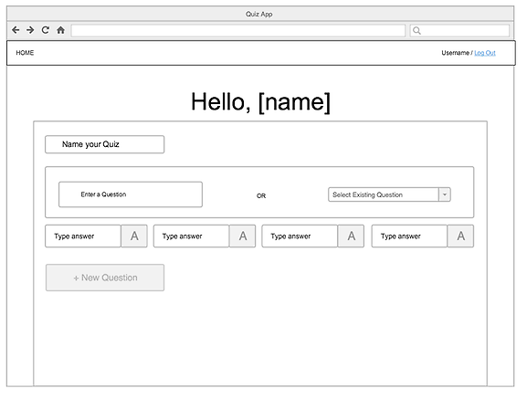
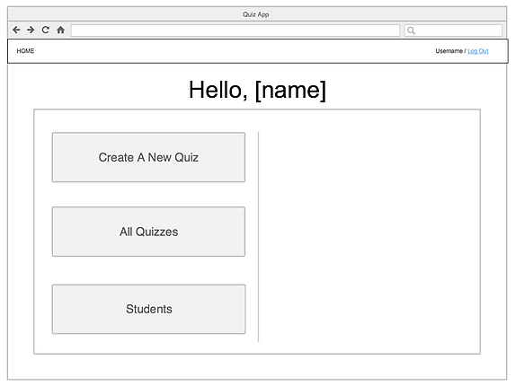
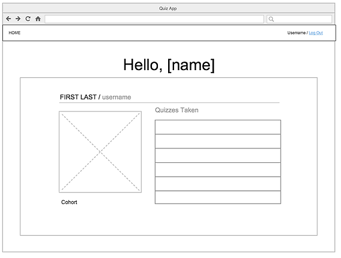
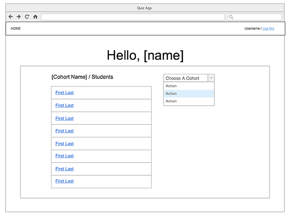
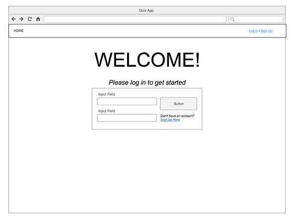
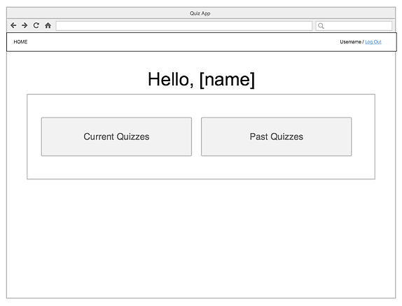
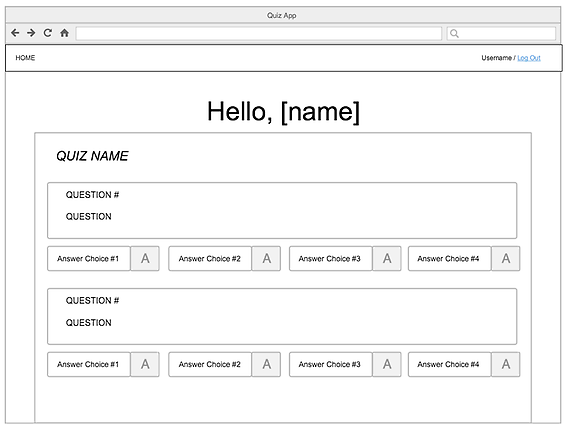
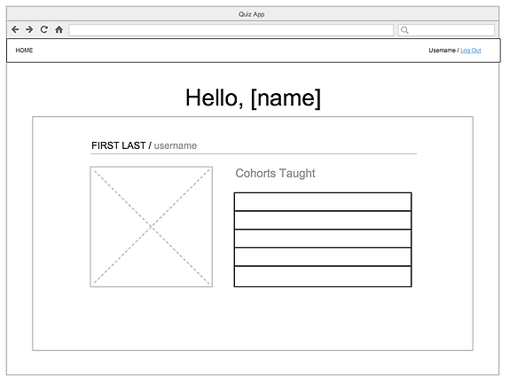
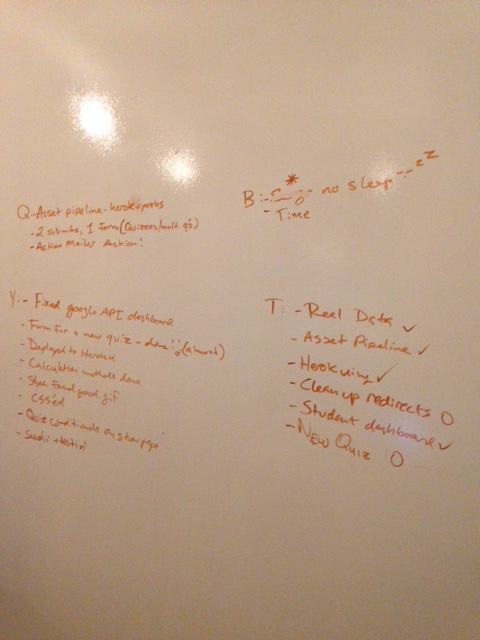

#Read Me

## QuizApp

With this app, an instrutctor can manage student cohorts, create and administer quizzes, and keep track of grades.
https://quizapp-wdi.herokuapp.com/

### User Story:

An instructor user should:
* Be able to log in
* Be able to see a dashboard with:
    * A link to **creating** a new **quiz** and corresponding **answer key*** A link to **view** a **list** of **quizzes** and **answer keys** they've already created
    * **Notifications** about **quizzes** **students** have taken
* Be able to **view** individual **student** **progress**
* Be able to **create** a new **quiz**
    * A **quiz** is multiple choice 
    * **Questions** should be able to be formatted in Markdown
    * Each **question** has an **answer key**

A student user should:
* Be able to log in
* Be able to **view** a list of their old **quizzes** based on date or score and overall **progress**
* Be able to see quiz directly by visiting '/quiz' or see that no quiz us assigned
* Not be able to take a quiz from a previous day


*Added Features*:
* A **quiz** can be multiple choice or short, free-form (typed out, one word answers)
* An instructor 
* Be able to **view** summary of entire **cohort's** **progress** as a whole

## Sources
* http://guides.rubyonrails.org/association_basics.html#polymorphic-associations

* http://eewang.github.io/blog/2013/03/12/how-and-when-to-use-single-table-inheritance-in-rails/

###Wireframes 










###Entity Relationship Diagram:
```
  +-----------------+                                                +-----------------+
  |   Instructors   |               +----------------+               |    Students     |
  |                 |               |     Cohorts    |               |                 |
  |- name           |1              |                |1              |- name           |
  |- email          +---------------+ - name         +---------------+- email          |
  |- password_digest|              *| - instructor_id|              *|- password_digest|
  |- img_url        |               |                |               |- img_url        |                                             |                 |               |                |               |- cohort_id      |
  +--------+--------+               +----------------+               +--------+--------+
          1|                                                                 1|
           |*                                                                 |
  +--------+--------+               +----------------+                        |
  |     Quizzes     |               |    Responses   |                        |           
  |                 |               |                |                        |
  | - instructor_id |1              |  - choice      |*                       |        
  | - test_day      +---------------+  - student_id  +------------------------+                                     
  |                 |              *|  - quiz_id     |                                 
  |                 |               |  - question_id | 
  |                 |               |                | 
  +--------+--------+               +--------+-------+  
          *|                                1| 
           |                                 |
  +--------+--------+                        |
  |Questions_Quizzes|                        |
  |                 |                        | 
  | - question_id   |                        |
  | - quiz_id       |                        |
  |                 |                        |
  |                 |                        |
  |                 |                        |
  +--------+--------+                        | 
           |                                 |
       |*                                |
  +--------+--------+                        |
  |    Questions    |                        |
  |                 |                        |
  |  - content      |1                       | 
  |                 +------------------------+
  |                 |
  |                 |
  |                 |
  +--------+--------+      
      1|
       |*
  +--------+--------+
  |     Answers     |
  |                 |
  |  - choice       |
  |  - is_correct   |
  |  - question_id  |
  |                 |
  |                 |
  +-----------------+
```

###Planning




### Technologies Used
- Rails 4
- jQuery
- HTML
- CSS
- AJAX
- Google APIs
